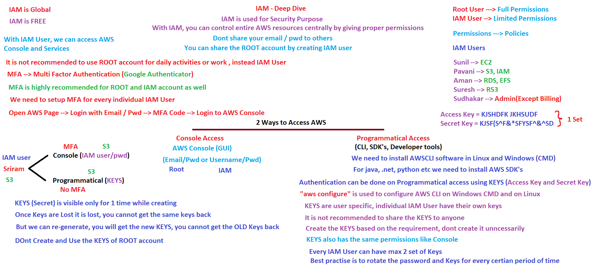
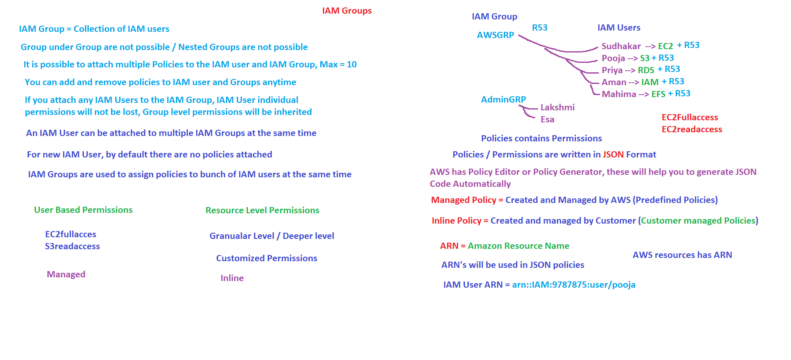
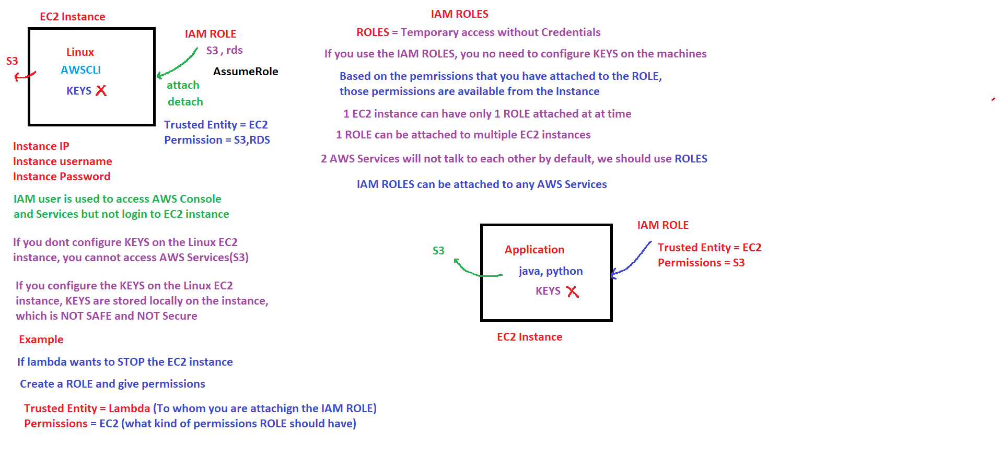
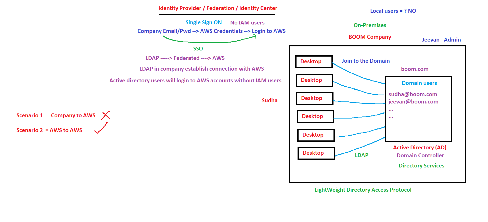
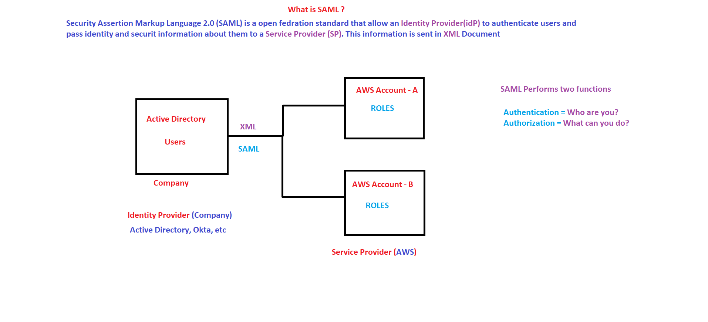
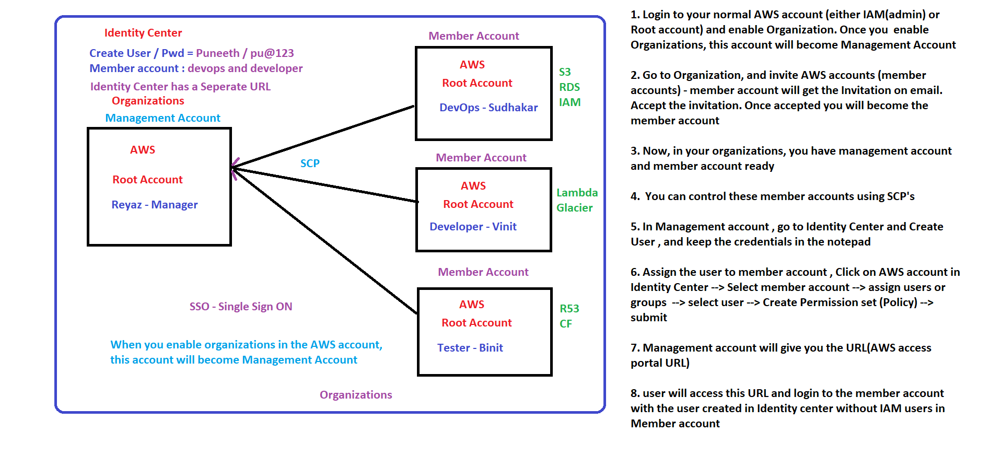
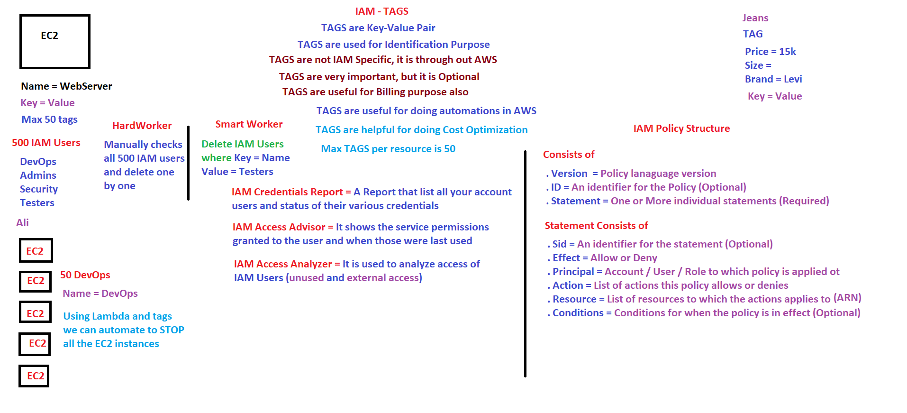
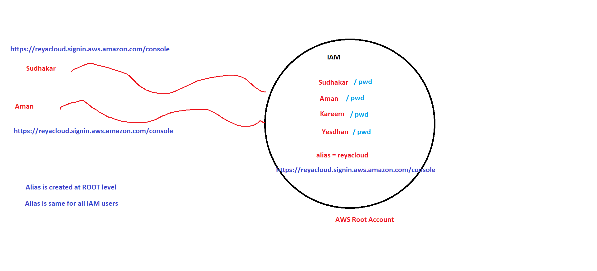
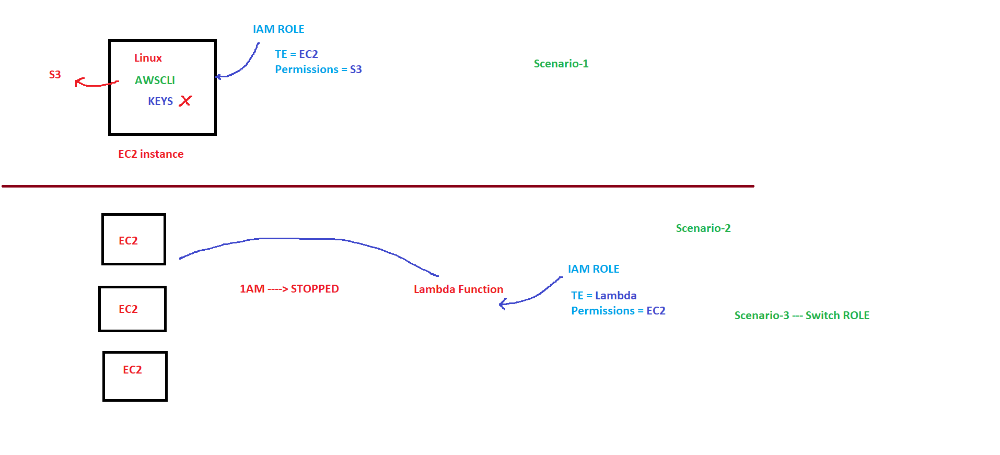
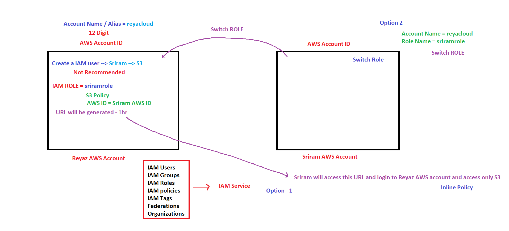

# AWS Cloud Computing Fundamentals & Core Services

Welcome to the foundational training module for AWS. Before deploying complex cloud architectures, it is critical to understand the underlying networking mechanics, traditional web tiers, core AWS primitives, and central governance frameworks.

This document serves as a comprehensive reference guide spanning basic web infrastructure, core AWS services, and Identity and Access Management (IAM).

---

## SECTION 1: Traditional Web Architecture & Networking Basics

### 1. Client-Server Model
At its core, web traffic operates on an **Asking and Giving** model:
* **Client:** The interface or software (e.g., a Web Browser) that requests a resource.
* **Server:** The computational engine that processes the request and responds with the information.
* **Network:** The interconnected fabric enabling data packets to flow between endpoints.



### 2. Architectural Evolution Tiers

* **1-Tier Architecture:** The user interface, business logic, and data storage reside entirely on a single machine. Primarily used for local development (`localhost`). It is **DEAD** for real-world deployments because it cannot scale.
* **2-Tier Architecture:** Multiple clients connect directly to a single server instance running both the application code and the database engine. This creates heavy resource contention (the app and database "fight" for RAM and CPU), leading to freezes, buffering, and crashes under load. **BIG NO FOR PRODUCTION.**
* **3-Tier / N-Tier Architecture:** The industry standard for modern, resilient applications. It physically isolates components into specialized layers:
  1. **Client Layer:** Public-facing front-end/UI.
  2. **Application Layer (Private):** Secure runtime environment hosting application code (Java, Python, .NET) via servers like Tomcat or IIS.
  3. **Database Layer (Private):** Structured data stores (MySQL, Oracle).
  * *Security Mandate:* The Application and Database tiers must **always** be sequestered within a private network tier, never exposed directly to the public internet.





### 3. DNS (Domain Name System) & Traffic Routing
Devices communicate across networks using unique **IP (Internet Protocol)** addresses, but humans rely on readable **Host Names** (e.g., `google.com`). DNS acts as the distributed internet registry converting Host Names to IPs.

#### The Resolution Journey:
1. **Local DNS / `/etc/hosts`:** The local machine checks internal cache for an existing IP mapping.
2. **Root Name Server (RNS):** Evaluates top-level domains (`.com`, `.org`, `.in`) and routes traffic forward.
3. **Name Server / SOA (Start of Authority):** Identifies the exact host records to resolve the definitive destination IP address.




### 4. Enterprise Traffic Control & Security
* **Load Balancer (LB):** Acts as a traffic cop, distributing incoming client requests sequentially across a cluster of backend web/application servers (using algorithms like **Round Robin**). This architecture ensures high availability and abstracts internal resource ports (translating public port `80`/`443` traffic to internal listener ports like `8080`).
* **Firewall:** A network guardrail that screens incoming data packets against prescriptive security policies (**Allow / Deny** rules) to prevent unauthorized perimeter intrusion.




### 5. Network Protocol Matrix & OSI Mapping
Data transmission is governed by strict protocols mapped across the standard 7-layer **OSI Model**.

| Protocol | Full Name | Default Port | Security Status | Core Responsibility |
| :--- | :--- | :--- | :--- | :--- |
| **HTTP** | HyperText Transfer Protocol | `80` | ❌ Unencrypted / Plain Text | Standard browser-to-server data movement. |
| **HTTPS** | HyperText Transfer Protocol Secure | `443` |  Encrypted (SSL/TLS) | Secure transactions utilizing identity certificates. |
| **SSH** | Secure Shell | `22` |  Encrypted Command Line | Secure remote terminal control of Linux instances. |
| **RDP** | Remote Desktop Protocol | `3389` |  Encrypted Graphical UI | Secure remote interface control of Windows instances. |

#### Core Transport Layer Protocols (Layer 4):
* **TCP (Transmission Control Protocol):** A connection-oriented protocol that establishes a reliable virtual bridge between hosts, guaranteeing all packets arrive in sequence with tracking verification.
* **UDP (User Datagram Protocol):** A connectionless protocol optimized for speed over reliability. It fires data streams continuously without checking for dropped packets.




---

## SECTION 2: Core AWS Compute & Storage Ecosystem

### 1. Compute Infrastructure Alternatives
* **EC2 (Elastic Compute Cloud):** High-control Virtual Machines running inside an AWS **Region**. Users configure, patch, and scale the operating system and dependencies directly.
* **Elastic Load Balancer (ELB):** A highly scalable, region-level managed service that spreads traffic across multi-AZ EC2 instances. Administrators cannot log into ELB instances; they interface strictly via a provided DNS URL.
* **Elastic Beanstalk (PaaS):** A managed platform engine. Developers upload application logic (Java, Python, Docker), and AWS handles autoscaling and provisioning under the hood while preserving root access to the backing EC2 instances.
* **Lightsail:** A simplified Virtual Private Server (VPS) package containing pre-installed software stacks (WordPress, GitLab, Nginx). It is designed for low complexity and **lacks auto-scaling**.
* **Lambda (Serverless):** An event-driven compute engine that runs code blocks strictly upon invocation without standing server management. Often integrated with **EventBridge** rules for scheduled resource workflows (e.g., calling Python scripts to `Stop` EC2 clusters at 9:00 PM and `Start` them at 6:00 AM to eliminate idle operational expenses).

---

## 2. Storage Paradigm Matrix

| Service | Architecture Type | Use Case & Performance Limits | Multi-Instance Sharing | Scope |
| :--- | :--- | :--- | :--- | :--- |
| **S3** | **Object-Based** | Flat-file structure utilizing bucket names and object keys. Scalable, supports static website hosting, accessed via HTTP endpoints. |  Globally via API | Regional |
| **EBS** | **Block-Based** | Dedicated raw hard drives attached to single instances as a Root volume (with OS) or Additional volume. Max size 16 TB. | ❌ Bound to a specific AZ | Availability Zone |
| **EFS** | **File-Based** | Network file system for Linux instances leveraging the NFS protocol. Scales capacity seamlessly without pre-provisioning. |  Simultaneously cross-AZ | Regional |
| **FSx** | **File-Based** | Highly performant managed file engine tailored explicitly for Windows native file structures. |  Simultaneously cross-AZ | Regional |
| **Glacier** | **Archive** | Low-cost, highly durable archive cold-tier storage. Has longer retrieval wait times. | N/A | Regional |

### Physical Migration: AWS Snow Family
Physical ruggandized appliances used to manually transport vast datasets to S3 when internet transport bandwidth is restrictive:
* **Snowcone:** Holds up to 8 TB.
* **Snowball Edge:** Holds up to 100 TB.
* **Snowmobile:** Transport truck container managing multi-Petabyte scale migrations.

---

## 3. Databases & Cache Tiering
* **Amazon RDS:** A managed Relational Database Service supporting 7 engines: MySQL, Oracle, MSSQL, PostgreSQL, MariaDB, Aurora, and IBM DB2. It automates replication, failovers, and patching, exposing a single access string endpoint.
* **DynamoDB:** A fully managed, highly transactional, low-latency serverless NoSQL database engine.
* **Redshift:** An enterprise-scale analytical cloud data warehouse optimized to query petabytes of structured log sets.
* **ElastiCache:** An in-memory key-value caching layer (running Redis or Memcached) deployed between application servers and primary databases to dramatically drop access latencies on repetitive data lookups.
* **CloudFront (CDN):** A global network of Edge Locations that caches copies of static and dynamic assets closer to geographic users, reducing origin loads based on **TTL (Time to Live)** controls.

---

## SECTION 3: IAM (Identity & Access Management)

IAM is a **Global** and **FREE** control plane utilized to handle centralized security identities and access constraints safely across AWS resources.

### 1. Root Accounts vs. IAM Users
* **Root Account:** The identity created during account generation. It possesses unrestricted system-wide control. **Never employ the Root user for everyday administrative tasks.**
* **IAM User:** Scoped identities built by account owners to give specific operators limited, auditing-compliant parameters. New users carry **no privileges out-of-the-box**.

### 2. The Two Primary Execution Entryways
* **Console Access (GUI Browser):** Uses explicit username/password credentials. Enforcing **Multi-Factor Authentication (MFA)** across all interactive console accounts is mandatory.
* **Programmatic Access (CLI / API / SDK):** Utilizes an unchangeable credential pair consisting of an **Access Key ID** and a **Secret Access Key**. 
  * *Security Notice:* Secret keys are displayed **once during generation**. If lost, they cannot be recovered and require deletion and replacement. **Never expose access keys within application repositories.**

### 3. Groups, Policies, and JSON Schematics
* **IAM Groups:** An administrative collection of IAM users. Permissions assigned to a group are inherited by its members. **Nested groups are structurally impossible.**
* **Managed vs. Inline Policies:** Managed policies are predefined, general templates designed and tracked by AWS. Inline policies are deep, customized rules written by the customer and attached directly to an explicit identity asset.
* **ARN (Amazon Resource Name):** A standardized string syntax used to distinctly name every specific object across the cloud fabric (e.g., `arn:aws:iam::123456789012:user/pooja`).

#### Standard IAM Policy JSON Layout:
```json
{
  "Version": "2012-10-17",
  "Statement": [
    {
      "Sid": "GranularPermissions",
      "Effect": "Allow",
      "Action": ["s3:GetObject", "s3:ListBucket"],
      "Resource": ["arn:aws:s3:::production-data-bucket/*"]
    }
  ]
}
